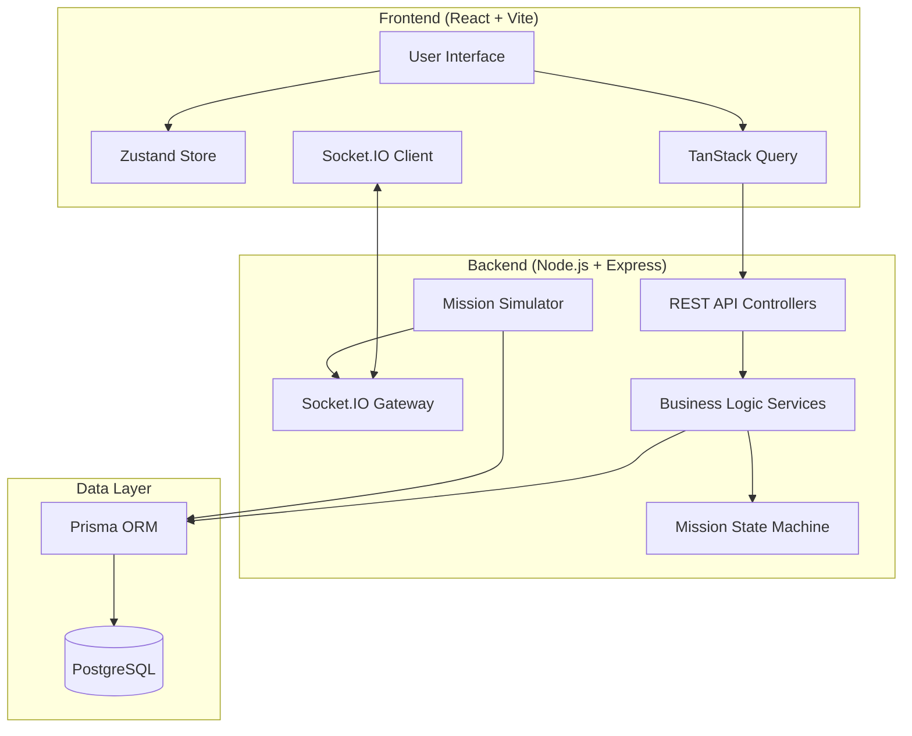
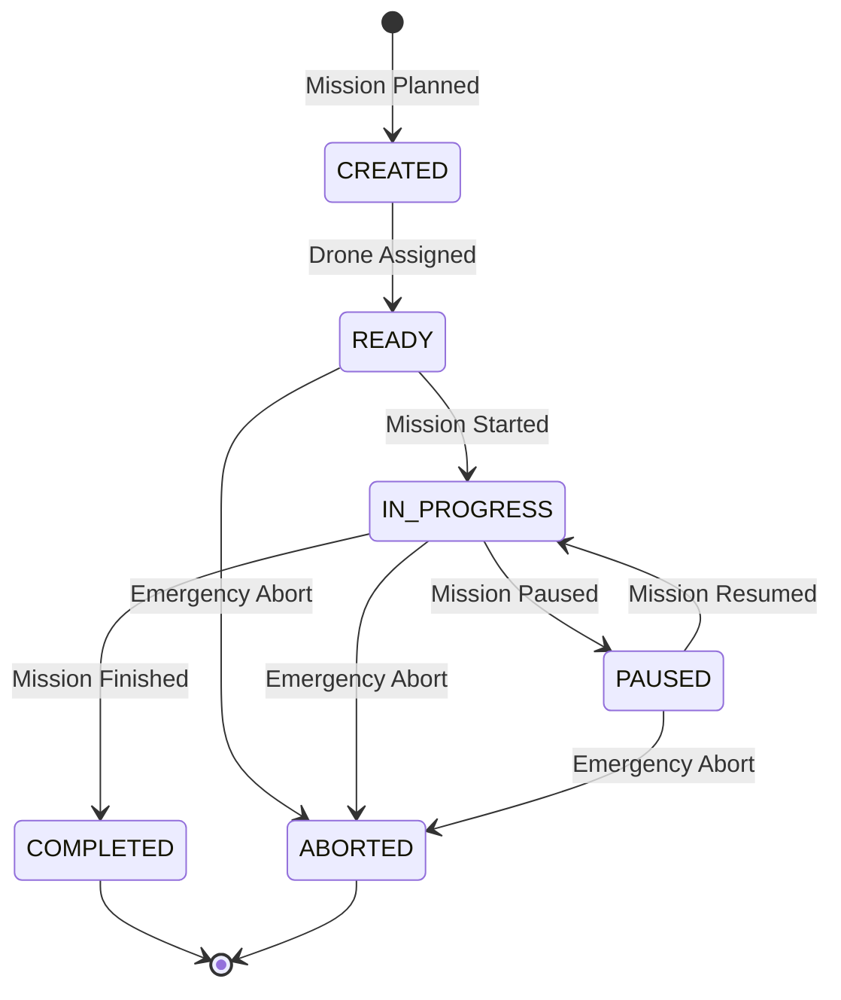
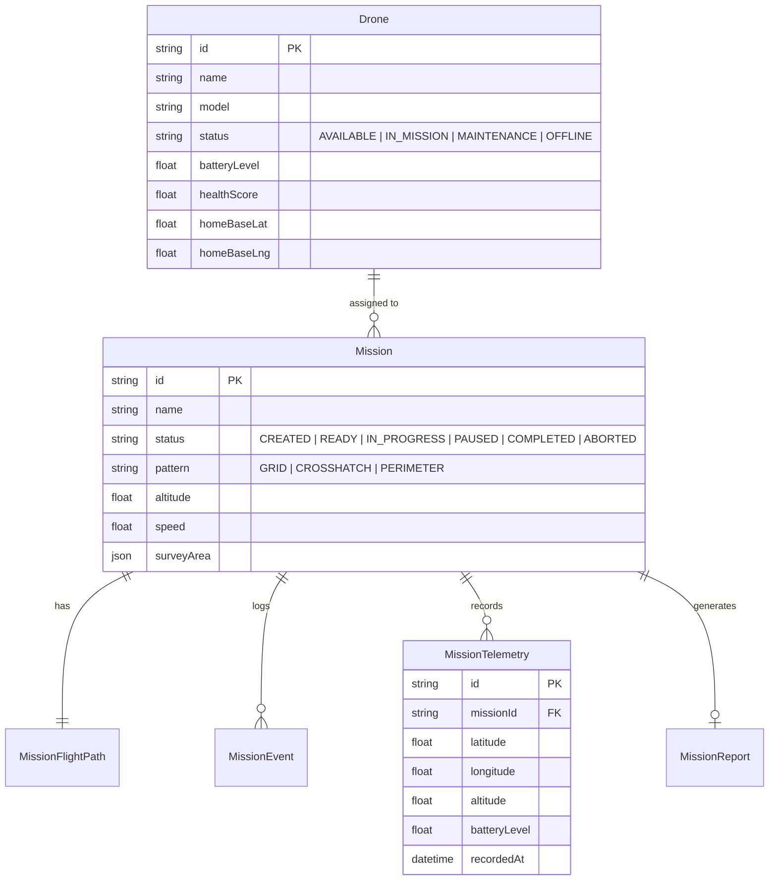
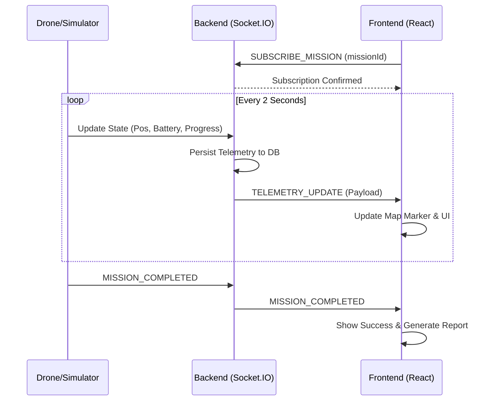

# 🚁 Drone Survey Management System

[](https://img.shields.io/badge/Platform-Web-blue)
[](https://img.shields.io/badge/TypeScript-5.x-blue)
[](https://img.shields.io/badge/React-18-61DAFB)
[](https://img.shields.io/badge/Node.js-18+-339933)
[](https://img.shields.io/badge/Prisma-6.x-2D3748)

A professional, enterprise-grade platform for planning, managing, and monitoring autonomous drone survey missions across global sites.

## 🌐 Live Demo

> [!IMPORTANT]
> Access the live application and API using the links below.

- **Frontend Dashboard**: [https://drone-command-center.vercel.app](https://drone-command-center.vercel.app)
- **Backend API**: [https://drone-survey-api.railway.app](https://drone-survey-api.railway.app)

---

## 📋 Project Overview

The Drone Survey Management System is designed to simplify complex drone operations. It provides a robust backbone for mission planning, real-time telemetry monitoring, fleet coordination, and automated reporting.

### Core Capabilities
- **Intelligent Planning**: Interactive map-based mission planning with support for Grid, Crosshatch, and Perimeter patterns.
- **Real-time Monitoring**: Low-latency WebSocket telemetry for live tracking of drone position, battery, and mission progress.
- **Fleet Coordination**: Centralized dashboard for monitoring drone health, status, and availability.
- **Automated Reporting**: Post-mission analytics including duration, distance, and coverage area.

---

## 🏗️ System Architecture

The system follows a modern decoupled architecture with a focus on real-time data flow and state consistency.



---

## 📊 Mission Lifecycle

Missions are governed by a strict state machine to ensure operational safety and data integrity.



---

## 🧬 Database Schema

The data model is normalized to support scalable fleet operations and historical telemetry tracking.



---

## 📡 Real-time Telemetry Flow

Telemetry data flows from the simulator (or real drone) to the frontend with minimal latency.



---

## 🛠️ Tech Stack

### Frontend
| Technology | Purpose |
|:--- |:--- |
| **React 18** | Component-based UI architecture |
| **TypeScript** | Static typing for robust development |
| **MapLibre GL** | High-performance vector map rendering |
| **TanStack Query** | Server state management and caching |
| **Zustand** | Lightweight client-side state management |
| **Tailwind CSS** | Utility-first styling for premium UI |
| **shadcn/ui** | Accessible and beautiful UI components |

### Backend
| Technology | Purpose |
|:--- |:--- |
| **Node.js** | Scalable server-side runtime |
| **Express** | Minimalist web framework |
| **Prisma** | Modern type-safe ORM |
| **PostgreSQL** | Reliable relational database |
| **Socket.IO** | Real-time bidirectional communication |
| **Zod** | Schema validation for API requests |

---

## 🚀 Quick Start

### Prerequisites
- Node.js 18 or higher
- PostgreSQL instance
- npm or yarn

### 1. Installation
```bash
# Clone the repository
git clone <repository-url>
cd flytbase

# Install dependencies for both components
cd backend && npm install
cd ../drone-command-center && npm install
```

### 2. Database Setup
```bash
cd backend
cp .env.example .env
# Configure DATABASE_URL in .env

npx prisma migrate dev --name init
npm run seed
```

### 3. Running Locally
```bash
# Start Backend (from backend directory)
npm run dev

# Start Frontend (from drone-command-center directory)
npm run dev
```

---

## 🎯 Key Features & Implementation

| Feature | Implementation Detail |
|:--- |:--- |
| **Mission Planning** | Polygon drawing with automatic waypoint generation based on pattern geometry. |
| **State Machine** | Enforced server-side state transitions to prevent invalid operations. |
| **Live Tracking** | Smooth marker interpolation and automatic map following. |
| **Safety** | Emergency abort with reason logging and automatic drone release. |
| **Analytics** | Aggregated data processing for mission and organization-level reports. |

---

## 🤖 AI Tool Usage

This project was developed using a "Human-in-the-loop" AI-assisted workflow.

- **Claude 3.5 Sonnet**: Used for architectural brainstorming, complex logic implementation, and documentation.
- **Cursor AI**: Leveraged for rapid prototyping, code refactoring, and boilerplate generation.

> [!NOTE]
> All AI-generated code was rigorously reviewed, tested, and refined by a human engineer to ensure it meets production standards for safety, performance, and maintainability.

---

## 📝 Design Decisions

1. **Atomic Transactions**: All mission state changes are wrapped in Prisma transactions to ensure that status updates and event logging are atomic.
2. **Idempotency**: The API supports idempotency keys for critical operations (start/abort) to prevent duplicate execution in unstable network conditions.
3. **Stateless Backend**: The backend is designed to be stateless, allowing for horizontal scaling behind a load balancer.
4. **Optimistic UI**: The frontend uses optimistic updates for a snappy user experience while maintaining eventual consistency with the server.

---

## 📄 License

This project is licensed under the MIT License - see the [LICENSE](LICENSE) file for details.

---

## 👥 Author

**Chand** - *Lead Developer* - [GitHub](https://github.com/chand)

Built with ❤️ for the FlytBase Design Challenge.
